# Final Project: CI/CD Pipeline with EKS, ArgoCD & GitHub Actions

End-to-end DevOps pipeline that automatically builds, pushes, and deploys a Python application to AWS EKS using GitHub Actions, Docker Hub, Terraform, and ArgoCD.

## Architecture

```
Developer → git push → GitHub Actions (build image) → Docker Hub
                              ↓
                     ArgoCD (watches repo)
                              ↓
               EKS Cluster (deploys app)
                              ↓
            NLB + NGINX Ingress → Python App
```

| Component         | URL / Details                                         |
|-------------------|-------------------------------------------------------|
| Application       | https://app.misha.devops10.test-danit.com             |
| ArgoCD Dashboard  | https://argocd.misha.devops10.test-danit.com          |
| Docker Hub Image  | `mishadevops206/my-python-server`                     |
| AWS Region        | `eu-central-1`                                        |
| EKS Cluster       | `misha` (1 node, t3.medium)                           |

## Project Structure

```
.
├── server/                          # Python application
│   ├── server.py                    # FastAPI backend server
│   ├── requirements.txt             # Python dependencies
│   └── Dockerfile                   # Container image definition
├── EKS/                             # Terraform infrastructure
│   ├── provider.tf                  # AWS, Kubernetes, Helm providers
│   ├── variables.tf                 # Project variables
│   ├── backend.tf                   # S3 remote state
│   ├── eks-cluster.tf               # EKS cluster definition
│   ├── eks-worker-nodes.tf          # Node group (1 node)
│   ├── iam.tf                       # IAM roles and policies
│   ├── sg.tf                        # Security groups
│   ├── acm.tf                       # ArgoCD Helm release
│   ├── ingress_controller.tf        # NGINX ingress + ACM + Route53
│   ├── ebs-csi.tf                   # EBS CSI driver
│   └── eks-external-dns.tf          # External DNS controller
├── k8s/                             # Kubernetes manifests
│   ├── deployment.yaml              # App deployment
│   ├── service.yaml                 # ClusterIP service
│   ├── ingress.yaml                 # NGINX ingress rule
│   └── argo.yaml                    # ArgoCD Application
└── .github/workflows/
    └── docker-publish.yml           # CI pipeline
```

---

## 1. Python Backend Server

A simple FastAPI server that listens on port 8000 and returns status 200.

### Backend code (`server/server.py`)

```python
from fastapi import FastAPI

app = FastAPI()

@app.get("/")
async def root():
    return {"status": "OK", "code": 200}

@app.get("/health")
async def health_check():
    return {"status": "healthy"}
```

### Dockerfile (`server/Dockerfile`)

```dockerfile
FROM python:3.9 as base

WORKDIR /usr/local/app

COPY requirements.txt ./

RUN pip install --no-cache-dir -r requirements.txt

RUN useradd -m app

COPY --chown=app:app . .

USER app

EXPOSE 8000

CMD ["uvicorn", "server:app", "--host", "0.0.0.0", "--port", "8000"]
```

### GitHub Repository

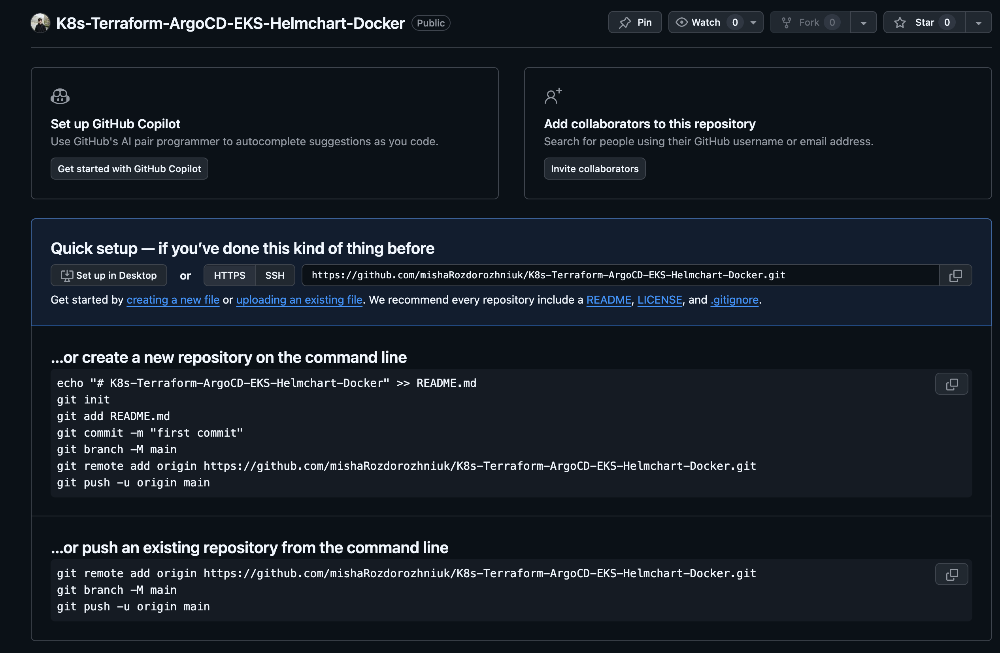

---

## 2. GitHub Actions CI Pipeline

The pipeline automatically builds and pushes the Docker image to Docker Hub on every push to the `main` branch. Docker Hub credentials are stored in GitHub Secrets.

### Pipeline code (`.github/workflows/docker-publish.yml`)

```yaml
name: Build and Push to Docker Hub

on:
  push:
    branches: ['main']

jobs:
  build-and-push:
    runs-on: ubuntu-latest

    steps:
      - name: Checkout code
        uses: actions/checkout@v3

      - name: Login to Docker Hub
        uses: docker/login-action@v2
        with:
          username: ${{ secrets.DOCKERHUB_USERNAME }}
          password: ${{ secrets.DOCKERHUB_TOKEN }}

      - name: Set up Docker Buildx
        uses: docker/setup-buildx-action@v2

      - name: Build and push
        uses: docker/build-push-action@v4
        with:
          context: ./server
          file: ./server/Dockerfile
          push: true
          tags: ${{ secrets.DOCKERHUB_USERNAME }}/my-python-server:latest
```

### Docker Hub Access Token

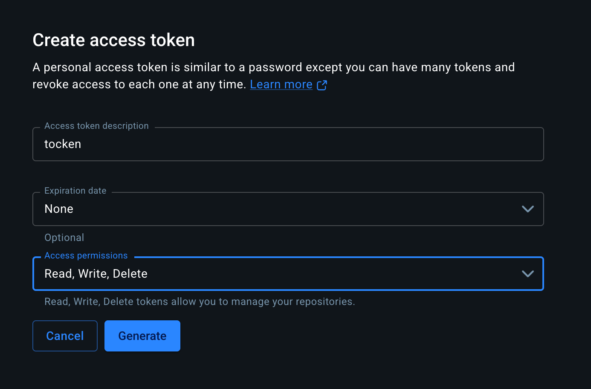

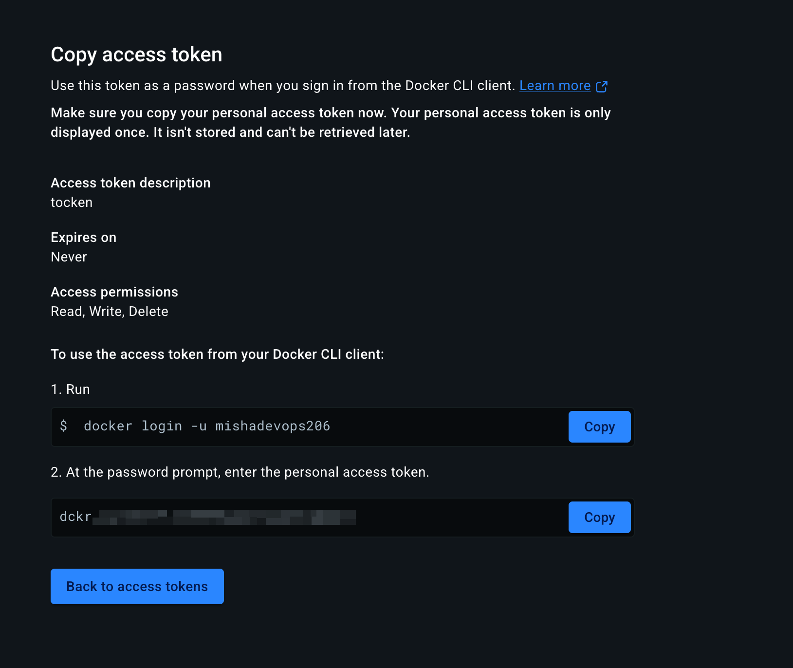

### GitHub Secrets Configuration

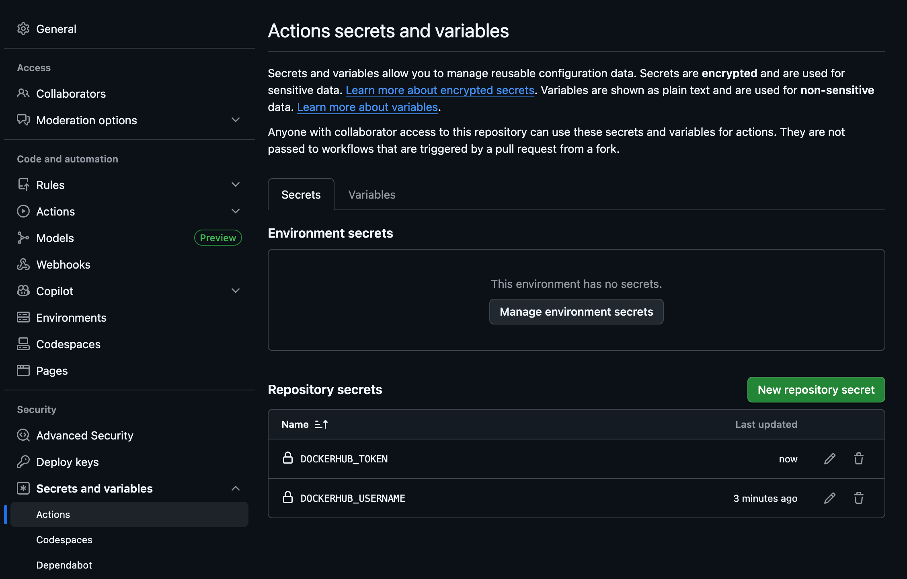

### Successful Pipeline Run

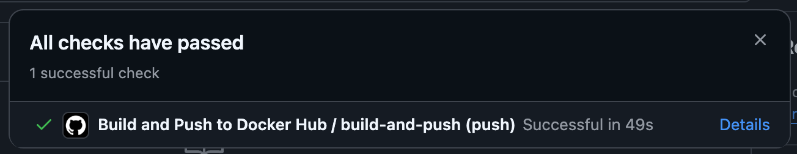

### Docker Hub Image

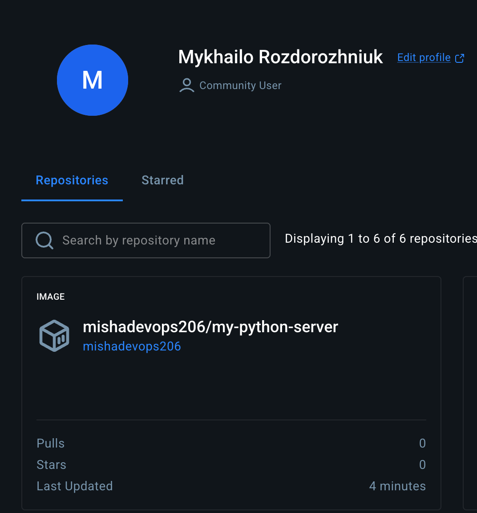

---

## 3. EKS Cluster with Terraform

Terraform provisions the entire infrastructure: EKS cluster, node group (1 node), NGINX ingress controller with NLB, ACM certificate, and Route53 DNS records.

### EKS Cluster (`EKS/eks-cluster.tf`)

```hcl
resource "aws_eks_cluster" "danit" {
  name     = var.name
  role_arn = aws_iam_role.cluster.arn

  vpc_config {
    security_group_ids = [aws_security_group.danit-cluster.id]
    subnet_ids         = var.subnets_ids
  }

  depends_on = [
    aws_iam_role_policy_attachment.kubeedge-cluster-AmazonEKSClusterPolicy,
    aws_iam_role_policy_attachment.kubeedge-cluster-AmazonEKSVPCResourceController,
  ]
}
```

### Node Group — 1 node, t3.medium (`EKS/eks-worker-nodes.tf`)

```hcl
resource "aws_eks_node_group" "danit" {
  cluster_name    = aws_eks_cluster.danit.name
  node_group_name = var.name
  node_role_arn   = aws_iam_role.danit-node.arn
  subnet_ids      = var.subnets_ids

  scaling_config {
    desired_size = 1
    max_size     = 1
    min_size     = 1
  }

  instance_types = ["t3.medium"]
}
```

### NGINX Ingress Controller with NLB + ACM (`EKS/ingress_controller.tf`)

```hcl
module "acm" {
  source  = "terraform-aws-modules/acm/aws"
  version = "~> 4.0"

  domain_name = "${var.name}.${var.zone_name}"
  zone_id     = data.aws_route53_zone.selected.zone_id

  subject_alternative_names = [
    "*.${var.name}.${var.zone_name}"
  ]

  wait_for_validation = true
}

resource "helm_release" "nginx_ingress" {
  name       = "ingress-nginx"
  repository = "https://kubernetes.github.io/ingress-nginx"
  chart      = "ingress-nginx"
  version    = "4.10.0"
  namespace  = "kube-system"

  # NLB with SSL termination via ACM certificate
  set {
    name  = "controller.service.annotations.service\\.beta\\.kubernetes\\.io/aws-load-balancer-ssl-cert"
    value = module.acm.acm_certificate_arn
  }
  set {
    name  = "controller.service.annotations.service\\.beta\\.kubernetes\\.io/aws-load-balancer-type"
    value = "nlb"
  }
  set {
    name = "controller.service.annotations.service\\.beta\\.kubernetes\\.io/aws-load-balancer-scheme"
    value = "internet-facing"
  }
}

resource "aws_route53_record" "argocd" {
  zone_id = data.aws_route53_zone.selected.zone_id
  name    = "argocd.${var.name}.${var.zone_name}"
  type    = "CNAME"
  ttl     = 300
  records = [data.kubernetes_service.nginx_ingress.status[0].load_balancer[0].ingress[0].hostname]
}

resource "aws_route53_record" "app" {
  zone_id = data.aws_route53_zone.selected.zone_id
  name    = "app.${var.name}.${var.zone_name}"
  type    = "CNAME"
  ttl     = 300
  records = [data.kubernetes_service.nginx_ingress.status[0].load_balancer[0].ingress[0].hostname]
}
```

### AWS CLI Authentication

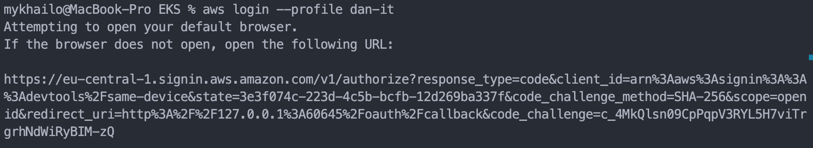

### Terraform Apply


### EKS Node Ready

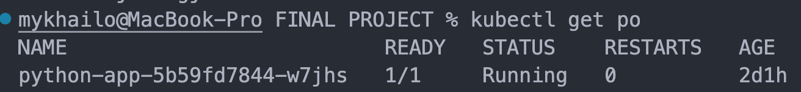

---

## 4. ArgoCD Installation via Helm Chart

ArgoCD is installed in the EKS cluster using a Terraform Helm release. The server runs in insecure mode (HTTP) since SSL is terminated at the NLB level.

### ArgoCD Terraform code (`EKS/acm.tf`)

```hcl
resource "helm_release" "argocd" {
  name       = "argocd"
  repository = "https://argoproj.github.io/argo-helm"
  chart      = "argo-cd"
  namespace  = "argocd"
  version    = "5.46.7"
  create_namespace = true

  values = [
    <<-EOF
    server:
      extraArgs:
        - --insecure
      ingress:
        enabled: true
        ingressClassName: nginx
        hosts:
          - argocd.${var.name}.${var.zone_name}
        annotations:
          kubernetes.io/ingress.class: nginx
    EOF
  ]

  depends_on = [
    aws_eks_node_group.danit,
    helm_release.nginx_ingress
  ]
}
```

### ArgoCD Pods Running

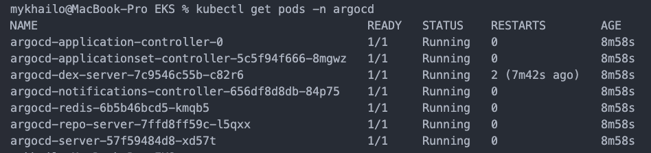

---

## 5. Kubernetes Manifests

### Deployment (`k8s/deployment.yaml`)

```yaml
apiVersion: apps/v1
kind: Deployment
metadata:
  name: python-app
  labels:
    app: python-app
spec:
  replicas: 1
  selector:
    matchLabels:
      app: python-app
  template:
    metadata:
      labels:
        app: python-app
    spec:
      containers:
        - name: python-app
          image: mishadevops206/my-python-server
          ports:
            - containerPort: 8000
```

### Service (`k8s/service.yaml`)

```yaml
apiVersion: v1
kind: Service
metadata:
  name: python-app-service
spec:
  selector:
    app: python-app
  ports:
    - protocol: TCP
      port: 80
      targetPort: 8000
```

### Ingress (`k8s/ingress.yaml`)

```yaml
apiVersion: networking.k8s.io/v1
kind: Ingress
metadata:
  name: minimal-ingress
  annotations:
    kubernetes.io/ingress.class: 'nginx'
spec:
  ingressClassName: nginx
  rules:
    - host: app.misha.devops10.test-danit.com
      http:
        paths:
          - path: /
            pathType: Prefix
            backend:
              service:
                name: python-app-service
                port:
                  number: 80
```

---

## 6. ArgoCD Application (GitOps)

ArgoCD watches the GitHub repository and automatically deploys changes from the `k8s/` directory on every new commit. Auto-sync with pruning and self-healing is enabled.

### ArgoCD Application manifest (`k8s/argo.yaml`)

```yaml
apiVersion: argoproj.io/v1alpha1
kind: Application
metadata:
  name: python-app
  namespace: argocd
spec:
  project: default
  source:
    repoURL: 'https://github.com/mishaRozdorozhniuk/K8s-Terraform-ArgoCD-EKS-Helmchart-Docker.git'
    targetRevision: HEAD
    path: 'k8s'
  destination:
    server: 'https://kubernetes.default.svc'
    namespace: default
  syncPolicy:
    automated:
      prune: true
      selfHeal: true
```

### Applying the ArgoCD Application

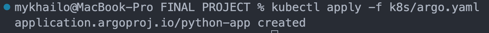

### ArgoCD UI — Application Synced

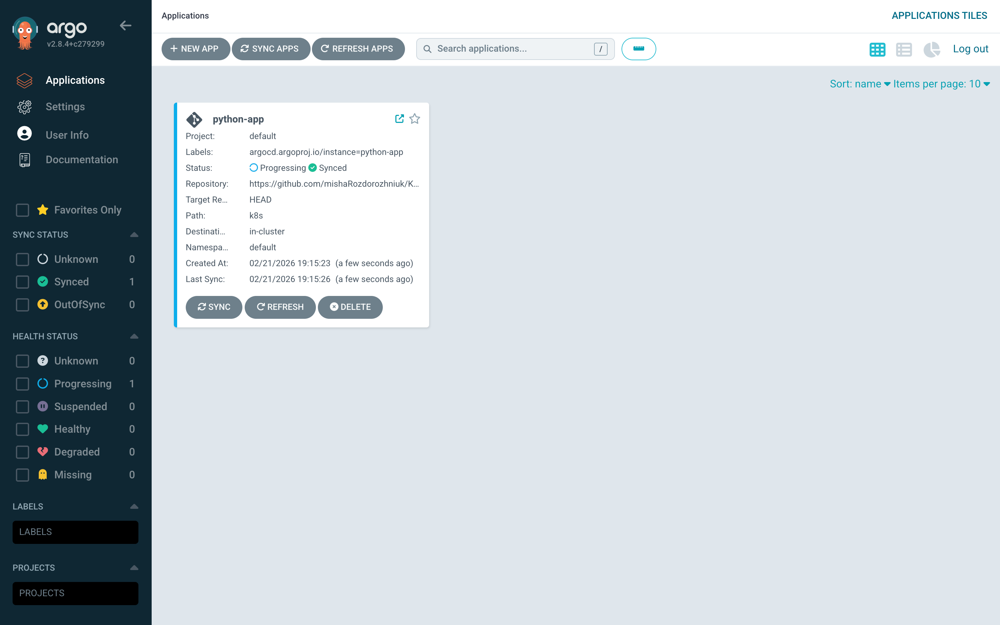

### Application Running on Correct Domain

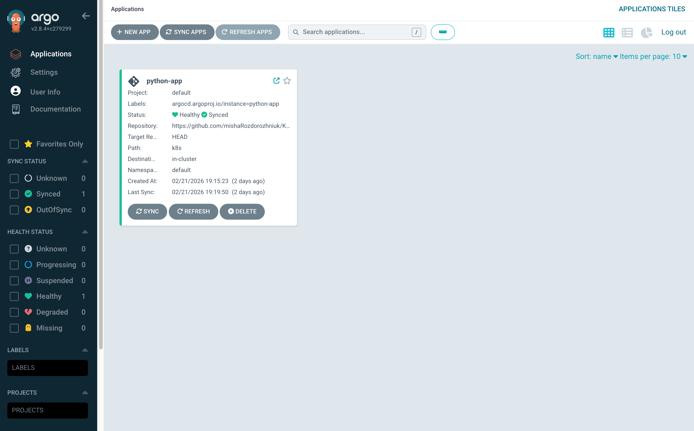

### Pod Details in ArgoCD


---

## How It All Works Together

1. **Developer pushes code** to the `main` branch on GitHub
2. **GitHub Actions** automatically builds a Docker image and pushes it to Docker Hub
3. **ArgoCD** watches the GitHub repository (specifically the `k8s/` directory)
4. When manifests change, ArgoCD **automatically syncs** the new state to the EKS cluster
5. **NGINX Ingress Controller** routes traffic from `app.misha.devops10.test-danit.com` to the application pods
6. **NLB** handles SSL termination using an ACM certificate for `*.misha.devops10.test-danit.com`

## Infrastructure Details

| Resource               | Configuration                          |
|------------------------|----------------------------------------|
| EKS Cluster            | `misha`, Kubernetes v1.34             |
| Node Group             | 1x `t3.medium`                        |
| Load Balancer          | AWS NLB (Network Load Balancer)        |
| SSL Certificate        | AWS ACM, wildcard `*.misha.devops10.test-danit.com` |
| DNS                    | Route53, zone `devops10.test-danit.com` |
| Ingress Controller     | NGINX Ingress v4.10.0                  |
| GitOps                 | ArgoCD v2.8.4 (Helm chart v5.46.7)    |
| Container Registry     | Docker Hub                             |
| Terraform State        | S3 bucket with encryption              |
